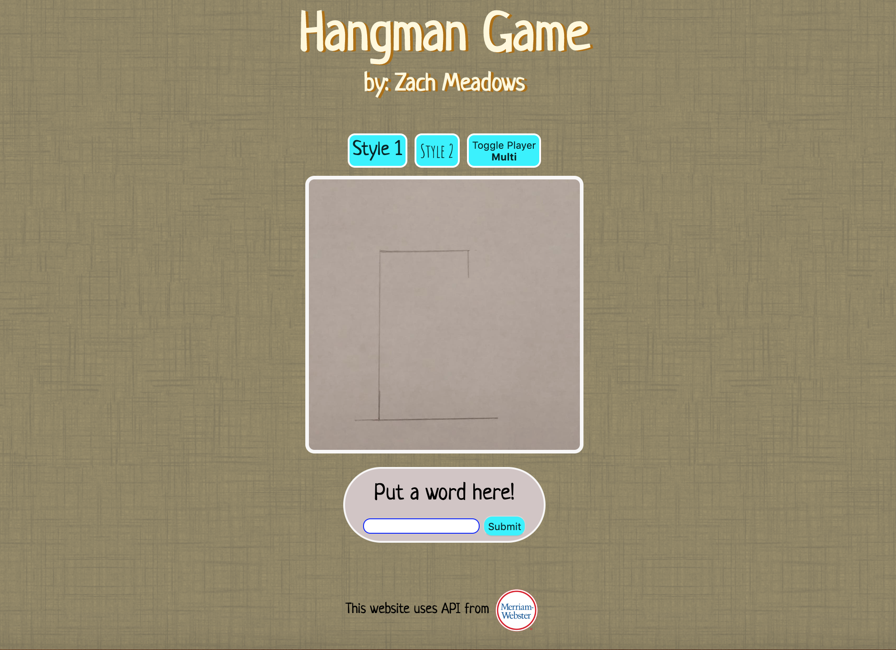

# Hangman Game
A simple game of Hangman. This game uses wordsAPI and dictionaryAPI(Merriam-Webster).

Features
------------
This game features the classic Hangman game style that you can play with friends along with a few extra bonuses, including:
- checking input to ensure the user/API has only given one word (no spaces or special characters)

- Two different art styles which will:
  - change the background texture and color
  - change the font used on the webpage
  - change the man being hanged, appropriately to which stage he's in.
  
- Solo Mode, which includes:
  - using wordsAPI which finds a random word
  - using dictionaryAPI to: 
    - make sure it's a word
    - finding the definition to the word, to be used as a hint

Current Bugs and possible future solutions
-------------------
- pressing toggle player quickly causes extra blanks to be produced 
  - set timeout for button to prevent clicks
- webster's API sometimes produces a word without a (shortdef)description 
  - prevent those words from being used 
  - fetch full definition

Features that could be added later
---------------------
- allow user/API to input phrases, multiple words, words that include hyphens or apostrophes
  - make sure special characters/spaces are displayed rather than being guessed
  - make sure special characters/spaces don't count toward word checking and word printing
- keep score of player performance
  - include timer
  - subtract points for wrong letter or using hint
